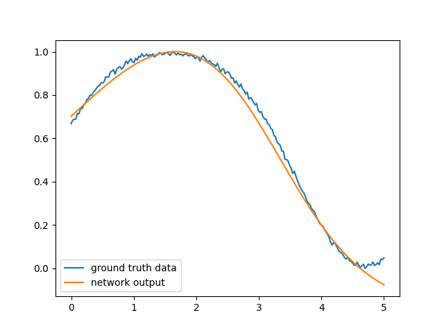

# Coding challenge: Neural Network Library
## The setup
You work in a machine learning team. Suffering from 'not-invented-here-syndrome', your team have decided to ignore 
existing neural network libraries such as *pytorch* or *Tensorflow* and instead want to develop their own 
neural network library from scratch. They give you the task to develop a small working prototype.

## The task
Write a very basic modular neural network library. The library should allow defining a basic multi-layer perceptron
network and training it in a supervised fashion. It should allow to define a model consisting of a sequential
chain of the implemented layers via an easy-to-use interface.

The network takes as input a single data sample (you may ignore batching of input data) and computes an output in a 
layer-by-layer fashion. The output feeds into a loss function (for example mean-squared error) to compute a loss in 
regard to the given groundtruth sample. For each layer, implement calculation of the local gradients w.r.t. to its
input and parameters (if any). Use the backprop algorithm to feed gradients back step-by-step from the loss function to
the input. Use simple stochastic gradient descent to adapt the parameters of the network.

You will need to implement the following:
- a linear neural network layer with bias (```y=xW+b```)
- a non-linearity of your choice (for example sigmoid)
- a loss function (for example mean-squared error)
- simple stochastic gradient descent to update the parameters of the parameters

Special care should be taken to make your implementation modular and extensible. Even though you will only need to 
implement the basic things listed above, your team may want to extend the library by implementing additional 
layers or non-linearities. Your implementation should allow this easily, i.e., use a modular interface and do not
hard-code the layout of the network or the math.

Use the data defined in ```data.txt``` and train a simple model using your library to show that your implementation
works. It contains pairs of one-dimensional input (```xi```) and ground truth (```yi```) values, one pair per row:
```
x1,y1
x2,y2
...
xn,yn
```

If your implementation is correct, a two-layer network with a sigmoid in the middle should be sufficient to approximate
the function that generated the training data. Below, you see a plot of the original ground truth data in blue, and the
output of a correctly trained model in orange:



**Implementing the maths correctly can be a bit tricky. If you don't get the maths right and if your network does not
converge, don't spend too much time on hunting errors. They are often very small but take a long time to find. In this
case, simply point out what works and what doesn't. We are more interested in the general structure of your code than on
the correct maths.**

## The math
Here are some resources that may help you with the maths:

[A Gentle Introduction To Math Behind Neural Networks](https://towardsdatascience.com/introduction-to-math-behind-neural-networks-e8b60dbbdeba):
Easy to understand introduction about the math behind perceptrons, forward- and backward propagation. Good to get a 
basic overview, but formulas are not applicable without modification since it only talks about a single layer.

[Backpropagation for a Linear Layer](https://web.eecs.umich.edu/~justincj/teaching/eecs442/notes/linear-backprop.html):
In-depth derivation of the math of a linear layer. Seems daunting, but you can ignore the derivations and directly use
the derived formulas for calculation of the gradients. Attention: This linear layer here does not have a bias. 

## General hints and remarks
* You may use a programming language of your choice. We would recommend *Python* (with *numpy*) or *C++* (with *eigen*). In 
  general, you may use additional libraries of your choice as long as they do not directly include the functionality that
  you are asked to implement (i.e., do not simply code another frontend for pytorch ;)). You'll only really need a linear
  algebra library though.
* If you use numpy, be careful with its semantics of array-array mulitplication and broadcasting. Best to treat 
  everything as matrices and use ```np.matmul``` as this will give you an exception if your matrix dimensions don't match
  instead of unintentially masking those errors by broadcasting.
* To give you an indication of the size of this task: Our reference solution is about 220 lines of python code,
  including data handling, training, the neural network code, and a basic plot of the output values. 
